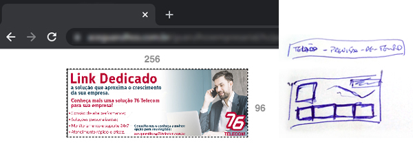

# Banner p/ Telão - temperatura do dia

> Banner animado de 10s que busca informação de temperatura através de apis e apresenta elas com elementos do clima animados.

Será um banner de 10s com tamanho 256x96 animado que pegará a localização conforme indicação e trará uma previsão do tempo do dia/semana usando apis para buscar dados de sites confiáveis sobre temperatura.

Terá também os elementos do clima animados para deixar mais ilustrativo a informação e chamar a atenção para o telão. Dessa forma entregando valor/conteudo ao público em troca atenção ao painel.
  

## Anotações

TELÃO - VIDEOS - 10s

256 X 96 - 
Taxa de dados - 258kbs
taxa de bits total - 590kbs
taxa de quadros - 25 quadros/segundo
---
Taxa de dados - 23kbs
taxa de bits dados - 154kbs
taxa de quadros 29.97 quadros/segundo

// FONTE PAINEL TELÃO
número -  26px - Oswald
texto simples - 18px - Arimo
titulo - 21pt - Myriad

## Histórico de Atualizações

* 0.0.1
    * Projeto Inicial (Obrigado ao @BrunoStel pela base do projeto inicial)

## Meta

André Sbrana - [@andresbrana3d](https://twitter.com/andresbrana3d) - andresbrana3d@gmail.com

Distribuido sobre a licença. Veja `LICENÇA` para mais informações.

[https://github.com/andresbrana3d/banner-previsao-de-tempo](https://github.com/andresbrana3d)